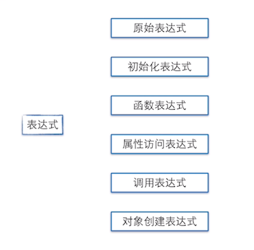
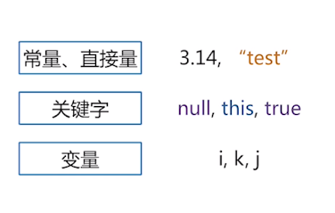
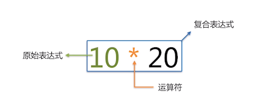
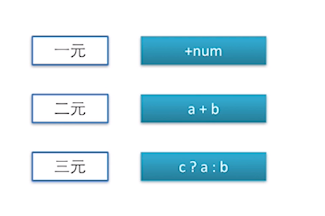
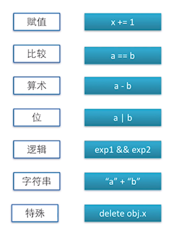

这次我们来说一下什么是表达式、运算符。

## 表达式
在Wiki（维基百科）上说：表达式是指能计算出值得任何可用程序单元。

在JS权威指南：表达式是一种JS短语，可使JS解释器用来产生一个值。
<!--more-->

**表达式的分类：**

### 原始表达式


### 数组、对象的初始化表达式

> **[1，2] 等价于  new Array(1,2)**
> **[1，，，4]	等价于  [1,undefined,undefined,4]**
> **{ x:1， y:2} 等价于 var o=new Object();  o.x=1; o.y=2;**

### 函数表达式

> **var fe = function(){};**
>  **(function(){console.log('hello world');})();**

### 属性表达式

> **var o = { x:1};**
> **o.x**
> **o['x']**


### 调用表达式
顾名思义，就是直接调用函数名加个括号。

>  **func();**

### 对象创建表达式

> **new func(1,2);**
> **new Object;**


## 运算符
运算符在JavaScript也是比较基础的东西，一般常用于表达式之间





**我们主要来说一下特殊运算符：**

### 条件运算符 ？：
条件运算，判断该变量c的boolean值。true的话返回a，false返回b。
> **c ? a:b**
> **var val = true ? 1:2; //val = 1**
> **var val = false? 1:2; //val = 2**


### 逗号运算符 ，
逗号运算会从左到右，最后取最右的值。

> **a , b**
> **var val =(1,2,3); // val =3**

### delete运算符
delete运算符是删除一个属性。

> **delete obj.x;**
> **var obj = { x:1 };**
> **obj.x;  //1**
> **delete obj.x;**
> **obj.x;  //undefined**

### in运算符
我们判断一个对象有没有key呢，可以用in window来进行判断对象有没有key。
> **window.x = 1;**
> **'x' in window ; // true**

### instanceof, typeof 运算符

> **{} instanceof Object //true**
> **typeof 100 === 'number' //true**

### new 运算符

> **function Foo(){};**
> **Foo.prototype.x = 1;**
> **var obj = new Foo();**
> **obj.x; //1**
> **obj.hasOwnProperty('x'); //false**
> **obj._proto_.hasOwnPropert('x'); // true;**


### this 运算符
 

> **this ; //window(浏览器)**
> **var obj = {**
> 	**func:function(){return this;}**
> **}**
> **obj.func(); //obj**

### void 运算符
void运算符比较少见，void也是一元运算符，void后面的操作是多少都会返回一个undefined。

> void 0；//undefined
> void (0); //undefined

```
console.log('收藏一下博客吧！ ')；
System.out.println('收藏一下博客吧！');
printf('收藏一下博客吧！ ');
alert('收藏一下博客吧！ ');
echo "收藏一下博客吧！ "
```

