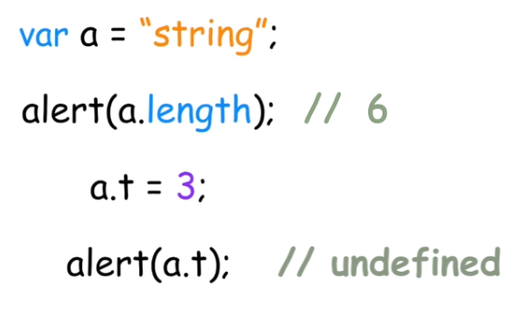

我们先看一下这三个符号！**= 、== 、 ===** 他们分别代表什么呢？

 1. =：一个等号它代表的是赋值。
 2. ==：二个等号表示比较，但是会做隐式类型转换。
 3. ===：三个等号表示严格比较，它是先比较类型，不会做隐式类型转换。
<!--more--> 

> 

 ## 隐式转换
### a == b
第一道首先是把字符串转化为number然后做比较，2和3类似前者先转换类型再做比较。

4和5是对象！对象他们是利用引用去比较的,否则返回false
> "1.23" == 1.23 		 //true 
>0 == false			 //true    
>null == undefined  		//true
>new Object() == new Object() 	//false
>[1,2] == [1,2] 		//false

### a === b

 - 类型不同：返回false 
 - 类型相同：
 

> null === null //true
> undefined === undefined	//true
> NaN ≠ NaN				
> new Object ≠ new Object 

**我们要注意NaN和Object这两个类型的比较，NaN跟任何一个类型比较都为false，Object要用引用比较**

> 

## 包装对象
基本类型不是对象, 所以没有属性和方法, 但是基本类型却可以用length()方法, 是因为js自动的把基本类型转化为临时对象, 然后再用这个length方法, 结束后再销毁掉临时对象。有种阅后即焚的感觉。

