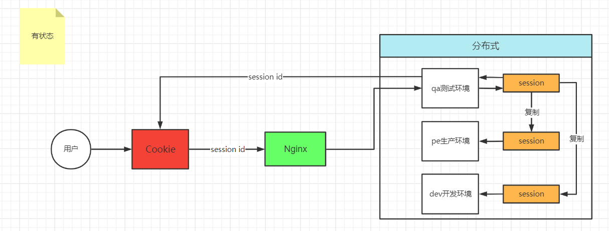
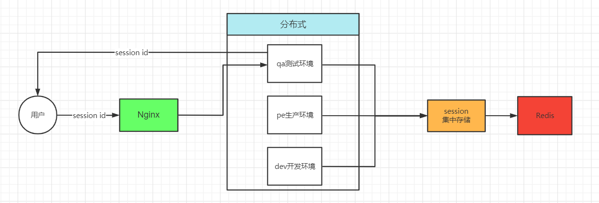
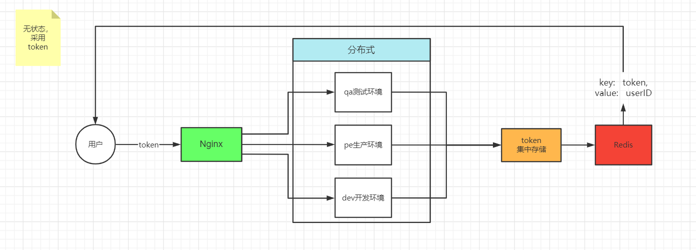
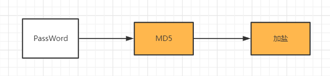
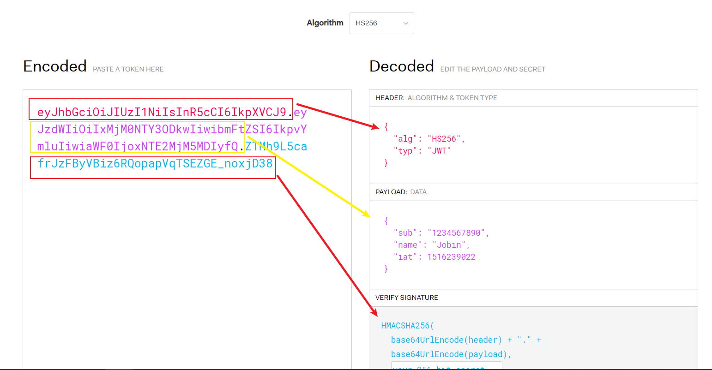
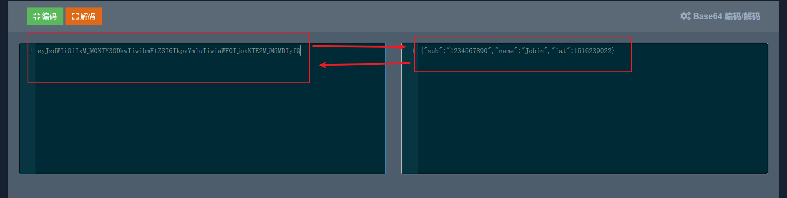

## 权限的控制机制

说到了登陆，那么我们会联想到权限的控制，决定用户登陆后的一些访问以及控制的权限。谈到权限的控制机制，目前使用的有`Session`，`Token`，`JWT（JSON Web Token）`，`oauth2.0`等等。


### (1) Session

对比起 `Cookie`，`Session` 是存储在服务器端的会话，相对安全，并且不像 `Cookie` 那样有存储长度限制，由于 `Session` 是以文本文件形式存储在服务器端的，所以不怕客户端修改 `Session` 内容。

通过session认证登陆的一个流程：
<!--more-->
1. 用户向服务器发送账户和密码。
2. 服务器验证通过后，在当前对话（session）里保存相关数据，比如用户角色、登录时间等等。
3. 服务器向用户返回一个session_id, 写入用户的Cookie。
4. 随后，用户的每次请求，都会通过Cookie的session_id传回服务器。
5. 服务器收到session_id后，查询之前保存的数据，就可得知用户的身份与权限。

在单体应用下，这种认证登陆以及权限的控制方式，基本没什么问题。

而在集群服务，也就是部署到多台服务器的状况下，使用`Session`进行登录后的权限控制流程大概如下：




在分布式架构的情况下，几台服务器的session是无法共享的，所以采用了复制`session`信息的方法，复制到另外几台的服务器上。这种方法会造成服务器的资源压力很大。也是一种缺陷。

为了解决`session`共享的问题，可以借用`Redis`持久化缓存,通过`Redis`集中的存储`session`信息。 流程如下：




### (2) Token

在集群服务的情况下，我们还可以使用`Token`的形式，也就是服务器无状态的情况下，把服务器生成的`Token`存放在`Redis`中。`Redis`的数据结构是`key` 与 `value` 的形式，而此时的key可以存放`Token`，而`Value`可以存放用户登录后的`UserId`。而这个`key`和`value`如何存储还是取决于你自己设计。 

下面是采用`Token`进行登录权限控制的流程：



关于密码在登录的过程，还可以采用MD5进行加密然后再进行加盐，可以确保它的安全性。



不过每次都需要通过`token`去查询用户的身份，对服务器的压力也是非常大的。


### (3) JWT

`JSON Web Token (JWT)` 是一个开放标准 ( [RFC 7519](https://datatracker.ietf.org/doc/html/rfc7519) )，它用于在各方之间以 `JSON` 对象的形式安全传输信息。此信息可以验证和信任，因为它是数字签名的。`JWT` 可以使用密钥（使用`HMAC`算法）或使用`RSA`或`ECDSA`的公钥/私钥对进行签名。

JWT的主要组成部分：
1. Header 头部
2. Payload 有效负载
3. Signature 验证签名

#### 1. Header 存放的数据
```json
{
  "alg": "HS256", // 加密的算法
  "typ": "JWT"    // jwt类型
}
```
#### 2. Payload 装载的数据

```json
{
  "sub": "1234567890",
  "name": "Jobin",
  "admin": true
}

```

#### 3. Signature 验证签名数据
```js
HMACSHA256(
  base64UrlEncode(header) + "." +
  base64UrlEncode(payload),
  your-256-bit-secret
)
```

#### 4. JWT底层结构原理

通常我们看到的JWT是这样子的，如：`xxxxxxx.yyyyyyyy.zzzzz`
它们是三个用点分隔的 `Base64-URL` 字符串，可以在 `HTML` 和 `HTTP` 环境中轻松传递，同时与基于 `XML` 的标准（如 `SAML`）相比更相似。
该 `JWT` 具有先前的`header`(头部)和`Payload`(有效负载编码)，并使用`Signature`(秘钥签名)。
也就是把上面的`xxxxxxx.yyyyyyyy.zzzzz` 相等于 `header.payload.signature`

`JWT`的数据是通过`Base64`进行编码和解码的，所以我们可以把一条`JWT`的数据去解码一下，看是否与之前的数据一致。

我们去`JWT`官方拿取`Payload`的数据去进行解码以及编码试试，可以从图中看出，就是一致的。也可以得出`JWT`的数据顺序。**在JWT中的Payload数据是无法被篡改的，所以有一定的安全性。**


`Payload`的`JWT`数据解码后：




#### 5. JWT的优缺点
优点：
1. 不需要在服务器存放用户的数据，减轻服务器端压力
2. 是`JSON`风格，轻量级
3. 可跨语言
   
缺点：

由于`JWT`生成之后是存放在`客户端（浏览器）`下的，当`Token`生成之无法修改：
1. 无法刷新`token`有效期 
2. 无法销毁`token`