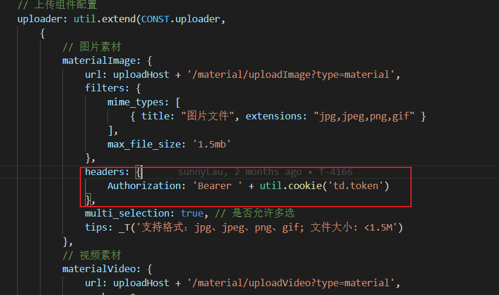
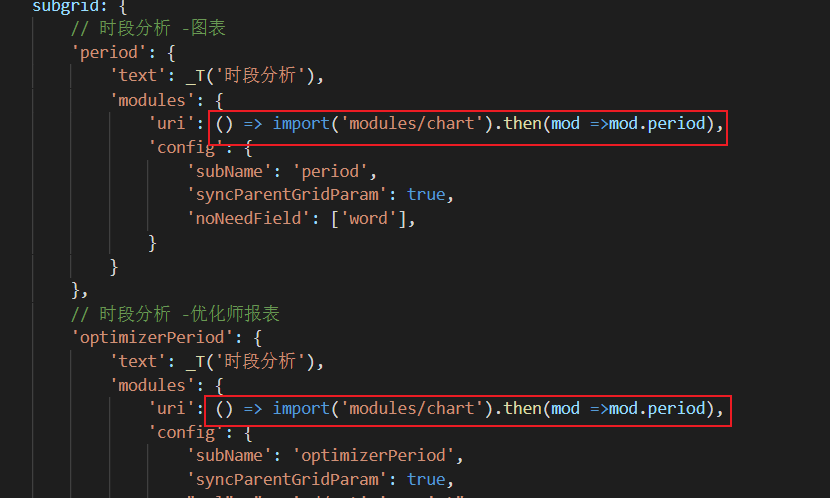
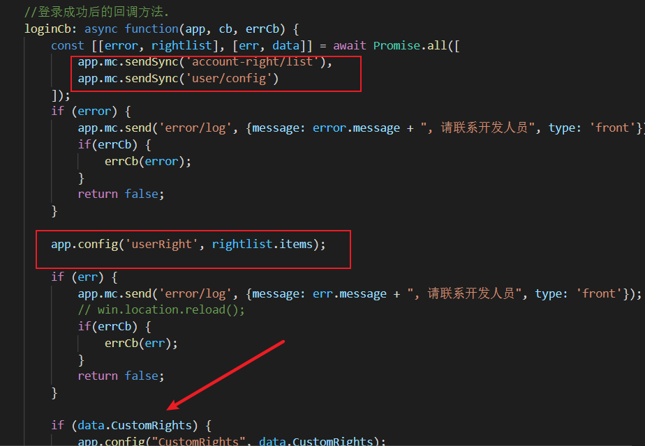
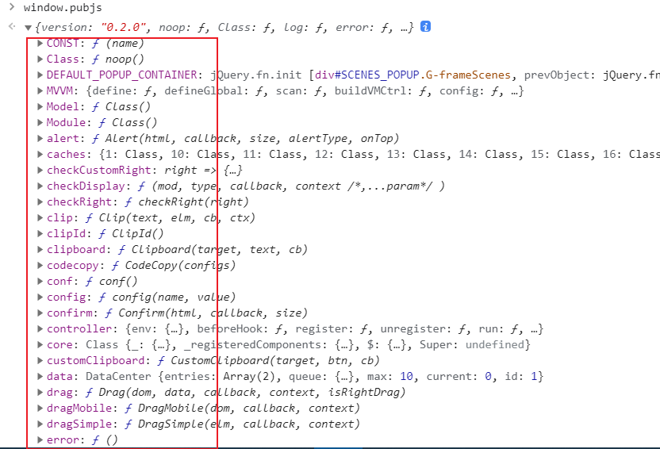
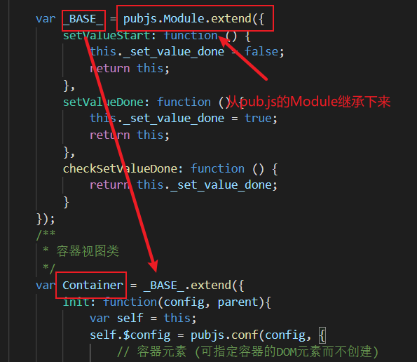
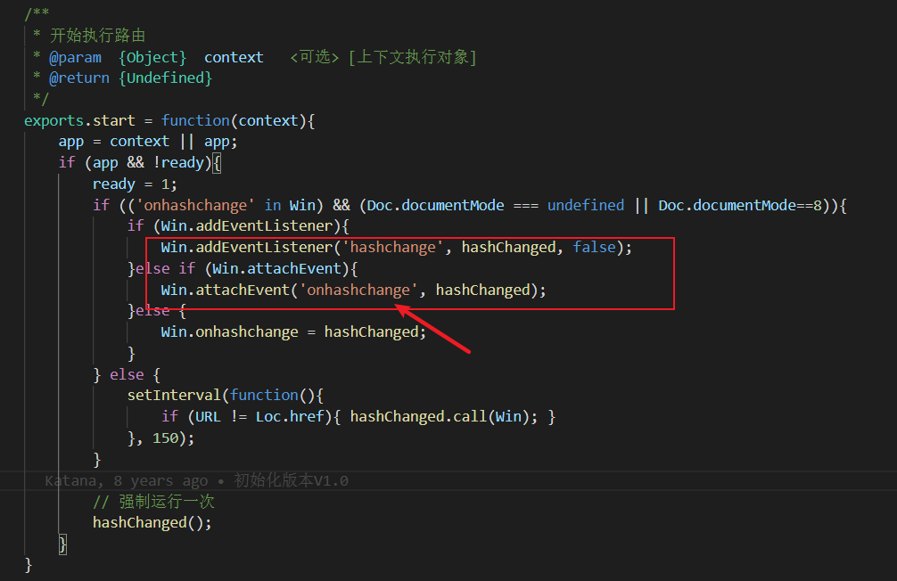
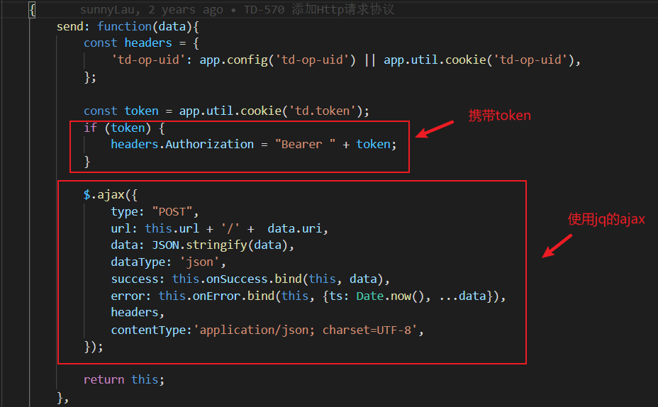

## （1）什么是pub.js

1. pub.js是什么？

   ```
   pubjs是一个基于Sea.js进行封装的框架，模块方式采用的是CMD（通用模块定义）的规范。
   主要提供核心模块，基础布局框架，基础组件库，基础样式库，基础插件库和第三方库，帮助开发具体业务功能界面。
   ```

2. pub.js如何挂载到window？

   ```
   在web/config/init.js文件进行系统全局配置后，然后挂载到浏览器上的window。
   而在这个文件中同时也涉及到了一些《目录配置》，《自定义权限和路由权限》，《用户登录的回调》，
   《素材上传特殊处理》以及一些《枚举变量》。
   ```
<!--more-->
   对素材上传进行了携带`token`处理：

   

   关于subgrid的一些页面是采用了`动态导入`的形式引入：

   

   用户登录后的回调处理：

   

   挂载上`window`后的`pubjs`,关于它的属性和方法，在控制台输出一下瞧一瞧：

   

   可以看出平时常用的`alert`, `core`,`controller`等等属性，都已经初始化挂载上去。直接调用`pubjs.core`或`pubjs.alert`使用对应的内置函数或者封装后的组件。


## (2) 关于pubjs中涉及到的事件

pubjs中封装了很多事件代理，有消息队列广播，通过jq代理ui事件。但是采用的是`冒泡事件`,当一个事件挂了，那将会导致事件传递失败。

1. 消息队列广播

   ```
   fire: 向父模块进行发送事件
   cast: 向子模块进发送事件
   ```

   举个栗子：

   ```js
   // 子模块
   this.fire('changeUI', param);
   
   // 父模块接收子模块事件
   const onChangeUI = (ev) => {
   	// 事件触发，ev.param是携带过来的参数
   }
   ```

2. 通过jq绑定和代理的事件

   ```js
   // 绑定jQuery对象事件
   uiBind: function(dom, type, data, callback){}
   
   // 代理jQuery对象事件
   uiProxy: function(dom, selector, type, data, callback){}
   ```

   


## (3) 组件/模块的构建调用

​	在pub.js核心源码中，路径：`pubjs/source/core/pub.js`文件下，里面已经封装了几种模块/组件构建调用方式。

1. 同步调用 `create` 方法

   同步调用构建模块时，需要注意以下几个点：

   - 组件调用前，需提前注册。

   - 在字符串模块中引用模块，也需要提前注册。

   - 在`init`的`config`配置的`module` 属性引用组件/模块时，需要提前注册。

     PS: 注册方法调用`this.register()`

   ```js
   const path = 'titlePackage/popwin/popwin';
   const mod = require(path).base;
   this.register(`${path}.base`,require(path).base; // 注册
   this.create('name', mod, config);
   ```

2. 异步调用 `createAsync` 方法

   当异步调用模块/组件时，可以不用注册组件，直接使用即可。

   ```js
   this.createAsync('name', 'titlePackage/popwin/popwin.base', config, callback);
   ```


## (4) 业务模块构建

业务模块构建，常见场景: pub.js组件，以及controller那边的路由。

通过`createBusiness`的API进行构建，不过首先要获取到`Container`，它是在容器上构建的。以下是一个构建例子：

```js
const title = LANG('巨量引擎批量创建');
const con = app.getContainer({
			scenes: 'main',
			full: false,
			sitelist: false,
			setup_btn: false,
			title: title,
			type: 'sidebar',
		});
app.core.get('SYS_PLATFORM').setPlatform(title);
con.createBusiness(data.name, require('business/action/list').main, {}, function(mod, notFirst){
    if (notFirst) {
        mod.reload().reset();
    }
});
```

如一个无权限页面的挂载：

```js
const con = app.getContainer({
    scenes: 'main',
    full: false,
    sitelist: false,
    setup_btn: false,
    title: LANG('没有权限'),
    type: 'sidebar'
});

con.createBusiness('noRights', require('login/action/noright').base, {
}, function (mod, isCreated) {});
```


## (5) 继承和扩展

1. 写业务模块的时候经常使用到的view.container.extend()

   ```js
   const view = require('@base/view');  // 引入的模块
   const aModule = view.container;  // 是view.js文件exports输出的容器视图类container
   const bModule = view.container.extend({});  // 继承和扩展这个类，实例一个容器出来
   ```

   

   2. 另外还有一个Widget（功能模块类）

      ```js
      const view = require('@base/view');  // 引入的模块
      const aModule = view.widget;  // 是view.js文件exports输出的功能模块类widget
      const bModule = view.widget.extend({});  // 继承和扩展这个类，实例一个容器出来
      ```

      

   

## (6) 路由

主要文件是`pubjs/source/plugins/controller.js`而在pub.js是采用监听浏览器URL的`hash`变化




## （7） HTTP请求

在pub.js上的发送的`http`请求是通过封装的mc模块里的send方法，`send`方法携带好`token`和一些其他处理后，基于jq的`ajax`进行发送`http`请求。

文件：`pubjs/source/plugins/mc.js`



