# 前端项目篇

当我们要熟悉一个项目的时候，首先看其`package.json`的`scripts`属性下的执行命令有哪些? 其次看打包构建工具的配置文件如何写，如`webpack`的`config`。

## 1. 进行查找入口在哪里？

   根据其步骤，在启动命令`start`里的配置可以知道涉及到了两个配置文件，一个是`webpack.pub.config.js`，一个是`vite`其对应的就是`vite.config.js`。
<!--more-->
   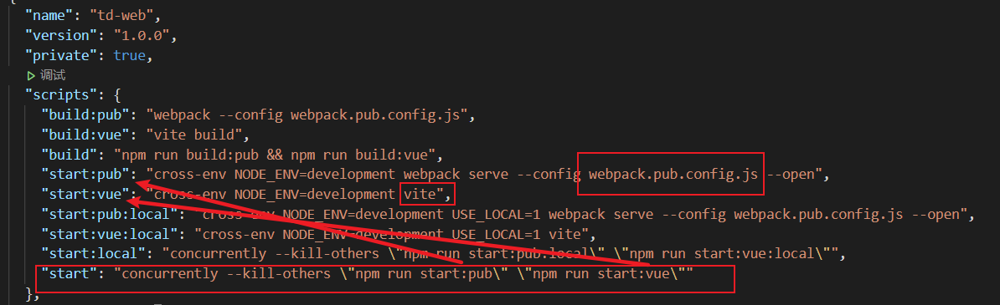

   进入`webpack.pub.config.js`先寻找`pub.js`的入口在哪里

   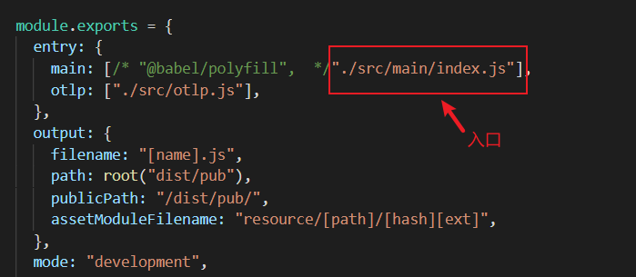

## 2. 根据路径`./src/main/index.js`进行探究

   (1) 在`index.js`文件里确定了这个是入口，可以看出该文件是一个立即执行的匿名函数，异步调用了`init`目录下的`index.js`文件。

   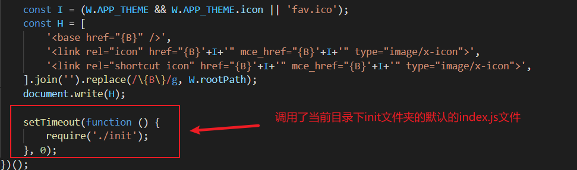

   (2) 该初始化文件先进行挂载兼容Window代码

   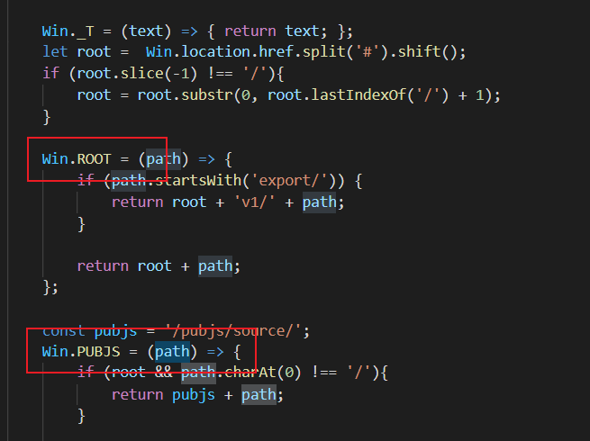

   (3) 接着进行一系列的加载静态资源（Less Css）以及第三方插件（jq/jqtouch）,进行初始化配置文件，然后也挂载一下jq

   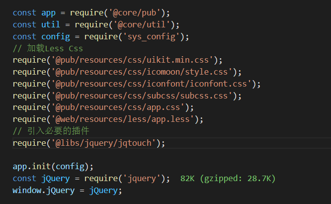

   (4) 然后进行获取页面容器并切换容器，还有是否创建混入`Vue`的页面，这个还需要查看当前目录下的`hybrid.js`进行的配置的`VueActions`。

   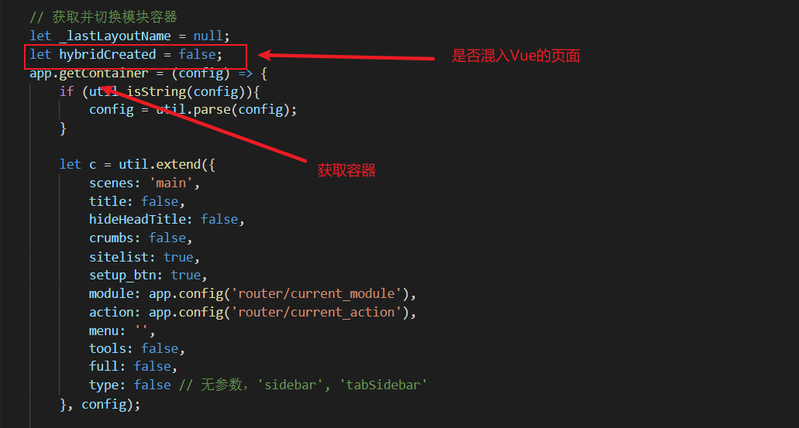

   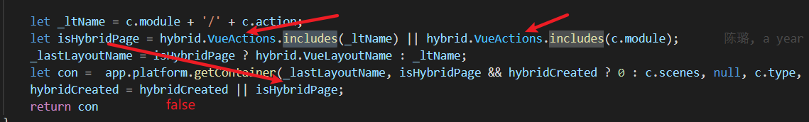

   (5) 进入`hybrid.js`文件进行探究时，可以发现原来`Vue的页面`是通过`iframe`进行嵌入到`pub.js`的页面里的。以此，我们可以知道：**pubjs包含Vue的集合关系**。

   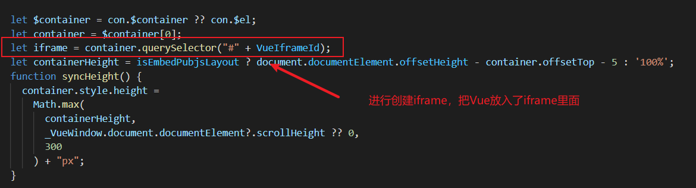

   (6) 我们继续返回研究`init/index.js`文件还有哪些初始化，这里我们看出还进行了`获取用户登录状态`然后进行`路由的鉴权`

   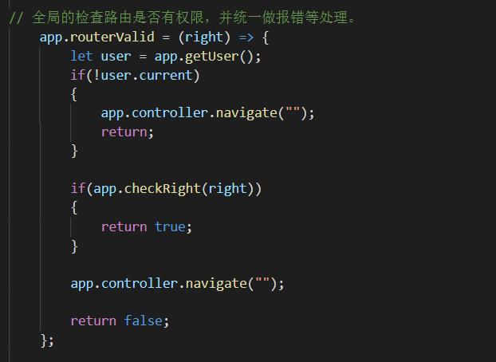

   （7）再下来就是对`pubjs`的`plugins`下的一些模块进行引入，然后进行路由的初始化。这里面近期还引入了一个新的打包优化，稍等根据两个新文件进行分析其作用。

   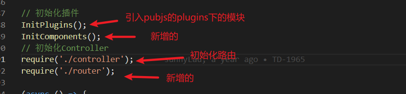

   （8）在这里的新增的`InitComponents()`是进行高频组件的注册，而导入的`router.js`这个文件是`webpack`打包的时候写入的，其里面的注册方式比较不一样，采用`动态import导入`的。

   `webpack.pub.config.js`配置文件：

   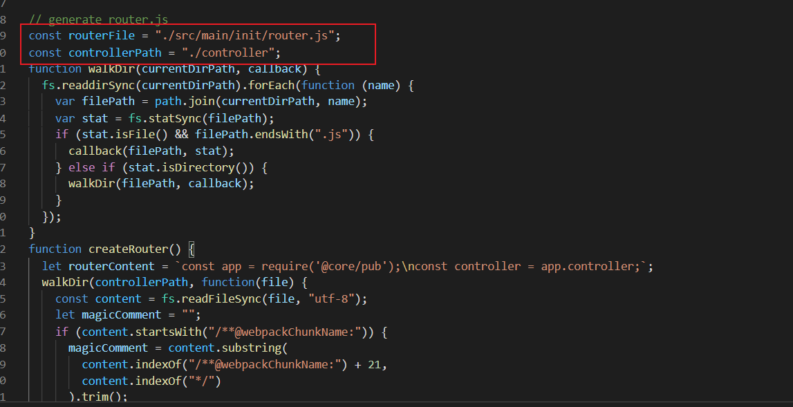

   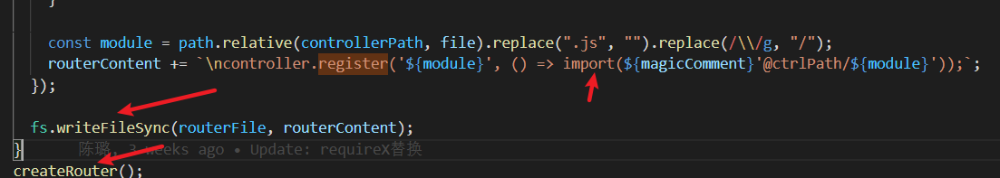

   根据目标写入后生成的`router.js`的内容：

   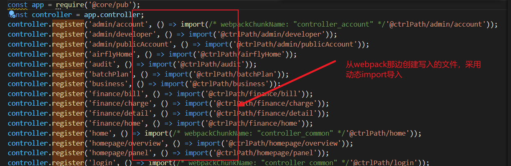

   （9）在这个`动态import导入`的好处是可以进行`分包`进行`懒加载`，从而可以提高**首屏的渲染速度**。在`webpack.pub.config.js`配置文件还进行了分包配置使用了`splitChunks`,在webpack这一块，里面还使用了一些技巧,比如对`代码的压缩`，还有开发时开启`devServer`的时候把写入`内存`的改为写入`磁盘`。这样子就不怕内存少跑不了多个项目啦

   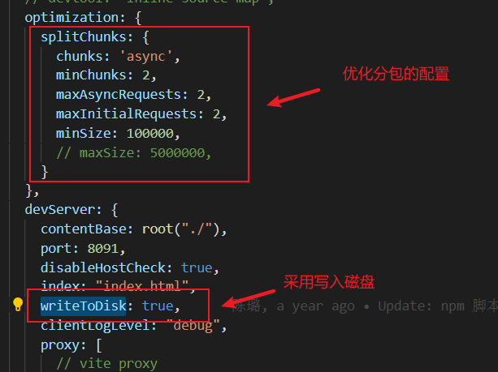

   (10) 我们继续回归主题，探究初始化还有哪些操作？接下来进行了发送登录请求，登录成功后，记录登陆地址，后面还进行了对登录状态一个`轮询`。也还进行了一些`自定义权限`检查。

   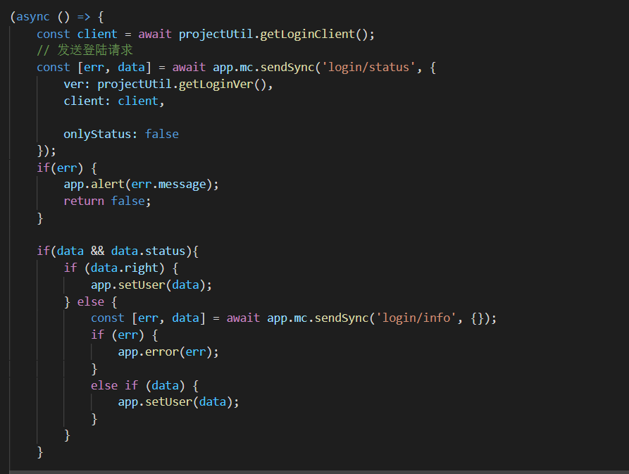

   (11) 最后一步就进行一些路由的挂载，然后启动路由。

   

## 总结下来的流程图如下：

   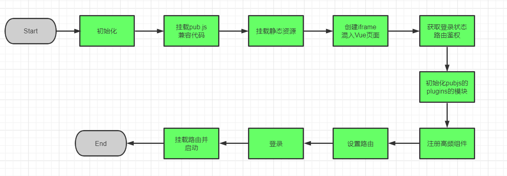

   

   

## 业务流程

   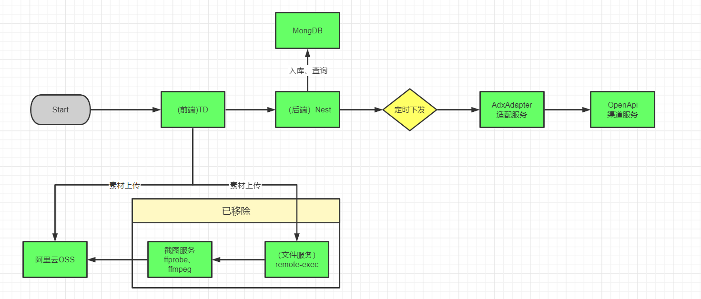

