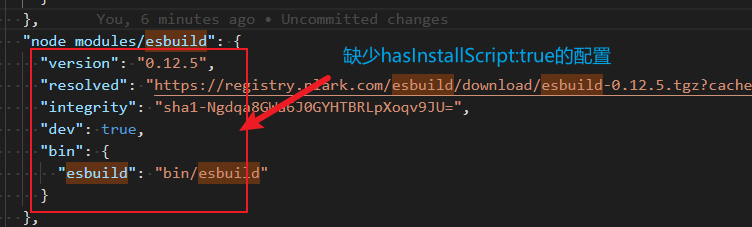
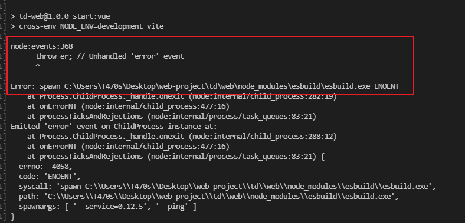
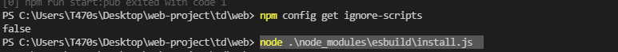

# 踩坑篇

## （1） vite打包时的一个ESBuild的问题

1. 背景：vite编译时，报了一个esbuild的问题。

2. 原因: **package-lock.json** 中 **"node_modules/esbuild"** 缺少 **"hasInstallScript": true** , 所以esbuild的install.js没有运行生成esbuild.exe。
<!--more-->


3. 报错截图：




4. 解决:  获取ignore-scripts情况是否为false, 如果是就执行node .\node_modules\esbuild\install.js 



5. 思考: 是esbuild的BUG还是npm生成package-lock.json的BUG呢？
5. 解决方案二: `npm install esbuild`    


## (2) 关于npm安装依赖包报错问题

1. 关于操作系统权限问题

   - 删除node-module文件
   - 以管理员方式打开cmd进行下面命令

   ```shell
   npm cache clean -f
   npm i
   ```

2. 关于npm 安装时 找不到目标目录的情况下的问题`（npm WARN enoent ENOENT: no such file or directory ）`

   - 删除package-lock.json

   - 清除node-module和缓存

   ```sh
   npm cache clean -f
   npm i
   ```

3. 以上问题都无法解决或者出现下面这种情况`（npm ERR! ENOTEMPTY: directory not empty, rmdir ） `可以使用pnpm，yarn，cnpm其中一个包管理工具来安装依赖

   ```sh
   npm i pnpm -g
   npm i yarn -g
   npm i cnpm -g
   ```

4. `（npm WARN enoent ENOENT: no such file or directory ）`对于这个问题，根本原因是npm和node的版本不一致，建议升级高一些的npm和node的版本。如

   ```
   node v16+
   npm v8.1+
   ```

   


