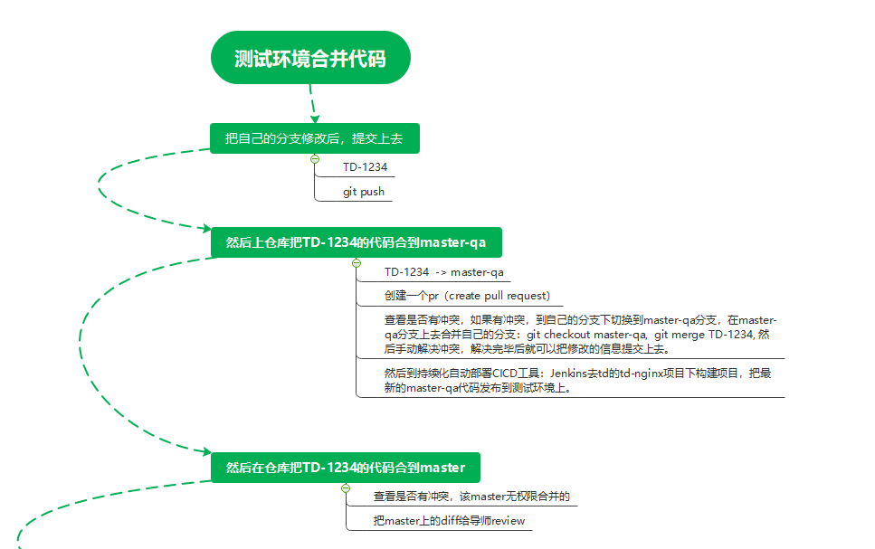
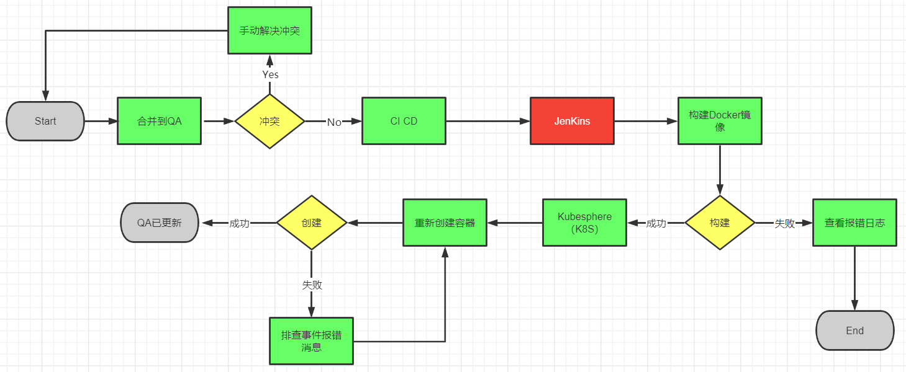

# Git篇

## （1）练气期

此阶段的教程是如何配置git，以及git的远程ssh和基本命令。

1. 安装git：

   ```
   https://git-scm.com/download/win
   ```
<!--more-->
2. git的基础命令

   ```
   git status				// 查询状态
   git add					// 添加文件到暂存区
   git commit -m "描述"	   // 提交暂存区
   git push				// 推送到远程仓库
   git pull				// 拉取远程仓库
   git reflog 				// 查询提交记录
   git reset "版本号"       // 回退到指定版本号
   git branch 				// 查看分支
   git branch "分支"  	   // 创建分支
   git checkout "分支"	   // 切换分支
   git config --list 		// 查看配置信息
   ```

   

3. 关于配置个人用户信息，有对全局所有库的配置和单个库配置

   ```
   git config user.name "用户名"  			// 配置单个库
   git config user.email "邮箱"   			//  配置单个库
   git config --global user.name  "用户名"		//  配置全局
   git config --global user.email  "邮箱"    		 //   配置全局
   ```

   

4. 如何配置ssh，让你的push and pull更加快速

   ```
   1. 在本地git base下 生成公钥 命名： ssh-keygen -t rsa -C "公钥描述"
   2. 密钥位置
   私钥 C:\Users\用户\.ssh\id_rsa
   
   公钥 C:\Users\用户\.ssh\id_rsa.pub （公钥用于Git仓库配置SSH keys）
   
   添加公钥到仓库：点击头像 -> Manage account -> SSH keys -> Add key -> 将本机公钥添加进来
   ```

   

   ## （2）筑基期

      1. git stash  // 先把修改文件放在缓存区
      2. git stash list // 查看缓存区
      3. git stash pop // 对缓存区栈弹出一个缓存，恢复其缓存状态
      4. git checkout -b master-qa origin/master-qa  // 把远程分支映射到现在切换并创建的分支
      5. git fetch master-qa:master-qa  //跟第四条一样，创建分支，并把远程分支映射到它
      6. git submodule update --init // 初始化子模块
      7. git merge TD-XXX 		// 把TD-XXX分支合到当前分支。


## （3）提交规范以及项目上的部署流程

1. 代码提交以及合并流程

   

2. 把qa的代码发布部署到测试环境上的流程



