# Nest.js 篇

## 1. Nest.js是什么？

   ```
   Nest.js 是一个 Node.js 的后端框架，它是对Express上做了一层封装，解决了架构问题。
   它提供了 Express 没有的 MVC、IOC、AOP 等架构特性，使得代码更容易维护、扩展。
   ```

   

## 2. Nest.js的核心技术: MVC、IOC、AOP

   ```
   MVC,IOC,AOP是Nest.js编程上最常用的核心技术，而这些技术类似于Java的Spring，
   在社区上，有一句对它的描述: "JS版的Spring"。
   ```
<!--more-->
  ### （1）MVC

   ```sh
   MVC是Model View Controller的简写。也就是模型层，视图层，控制层。
   它跟MVVM架构不一样，MVC架构下，请求会先发送到控制层(C) ，再由它调度模型层(M)的Service来完成业务逻辑，
   最后返回对应的视图层(V)。 下面是它的逻辑图。
   ```

  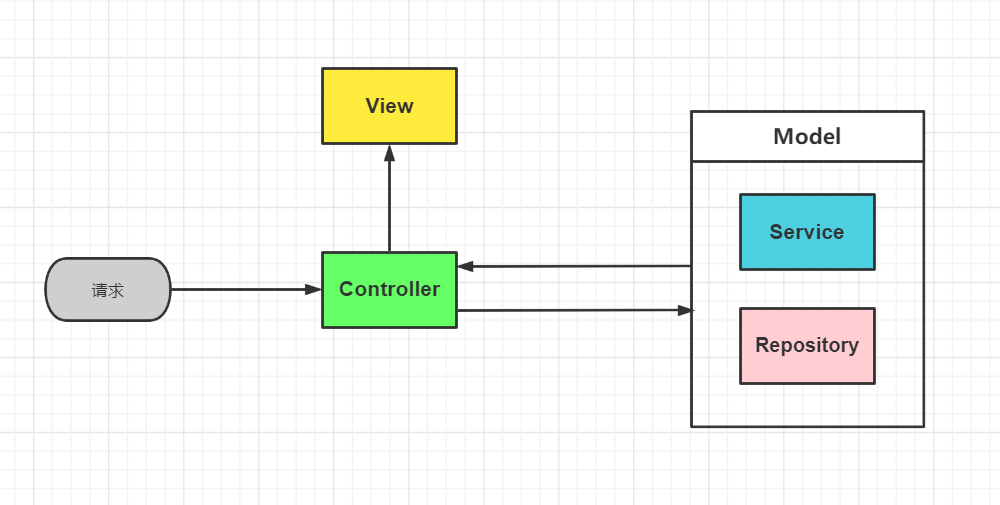
   

  ### （2）IOC

    
   （1）IOC是Inverse Of Control的简写。通过@Controller、@Injectable装饰器声明类（class） 就会被Nest.js扫描，创建对应的对象并添加到一个容器里，这些对象会根据构造器里声明的依赖 “自动注入”，也就是DI（dependency inject），这就是IOC的思想。
   
   （2）IOC架构的好处就是不需要手动创建对象和根据依赖关系传入不同对象的构造器中，一切都是自动扫描并创建、注入的。
    

   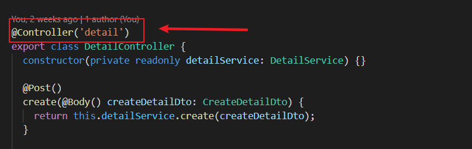

   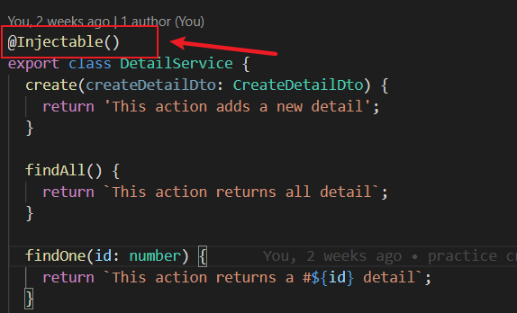

   

  ### （3）AOP

   ```
   AOP架构又是什么呢？AOP是Aspect Oriented Program的简写。也就是面向切面编程。
   
   ```

在Nest中，一个请求过来，会经过`Controller`到`Service`再到`Repository`。也就是MVC的一个流程。 在进入这个`Controller`之前呢，我们会进行一个`JWT`或者异常处理，日志处理等等。

如果直接在改造`Controller`控制层的代码，这显然很不优雅，可能还会使控制器变得无法控制。

   所以在进入控制层(C)之前，就进行了一个切面，在进入`Controller`之前做一些处理。 如下图：

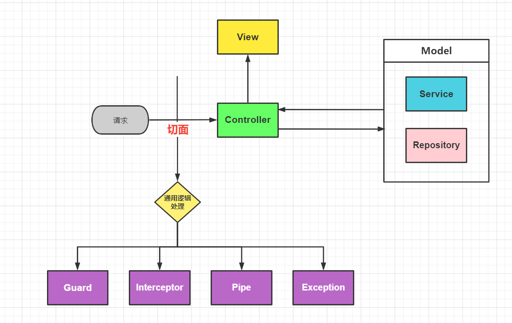

   在Nest.js实现AOP的方式有5种：`Gurad`（守卫）、`Pipe`（管道）、`Interceptor`（拦截器）、`ExceptionFilter`（异常过滤器）、还有`Middleware`（中间件）。

   而中间件来实现`AOP`比较特别，因为`Express`的中间件洋葱模型，它可以透明的在外面包一层，加入一些逻辑，内层感知不到。Nest.js的`Middleware`中间件是直接继承于Express框架的。

   ```
下面是AOP的一个例子代码:   
   ```

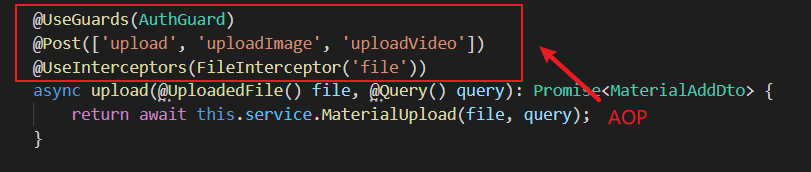

   上面的代码对单独的路由进行了`Gurad`和`Interceptor`加上了两层透明的逻辑（权限控制以及拦截器），这就是`AOP`的好处。

   ```
1. 思考：当AOP的五种创建方式同时存在的时候，是先执行哪种方式呢？

   ```

   在我们学习任何语言，都少不了看源码，特别在这种执行顺序方面上，我们常常都可以在源码找到我们的答案。针对这个问题，于是我就从github上clone下源码进行针对性的研究：

   ```
   主要文件：`router-execution-context.ts`

   ```

   (1) 首先我们看一下`create`函数返回的函数，由执行顺序看出，先判断`fnCanActivate`函数，这个函数是`Guard`的，也就是先用`Guard`判断是否有权限。

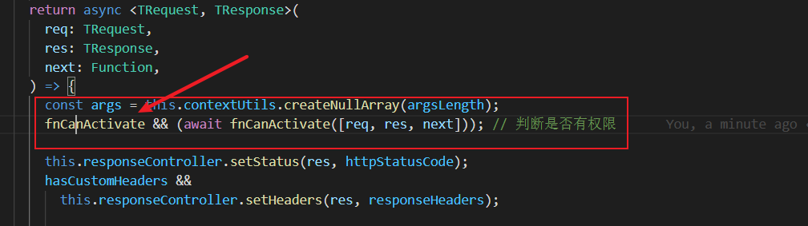

   (2)`fnCanActivate`是通过调用`createGuardsFn`函数，进入函数判断是否有权限，如果没有权限就抛出异常，而异常是由`ExceptionFilter`处理的。


   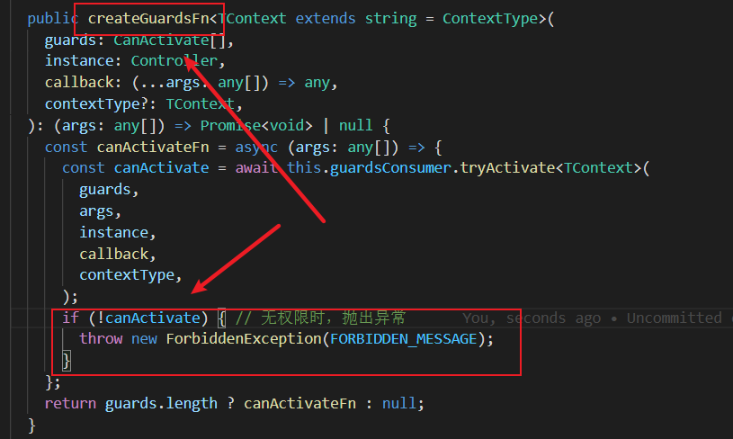


   (3)接下来进行调用了`Interceptor`拦截器处理，和`Guard`一样，进行链式调用处理。所有处理完后，最后调用`Controller`的方法。也就是进入路由。


   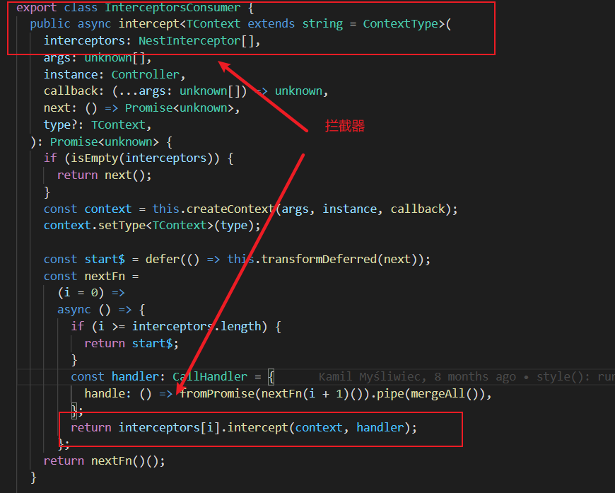


   (4) 进入路由前，也就是调用`Controller`方法之前，使用了`Pipe`去对这些参数进行处理。


   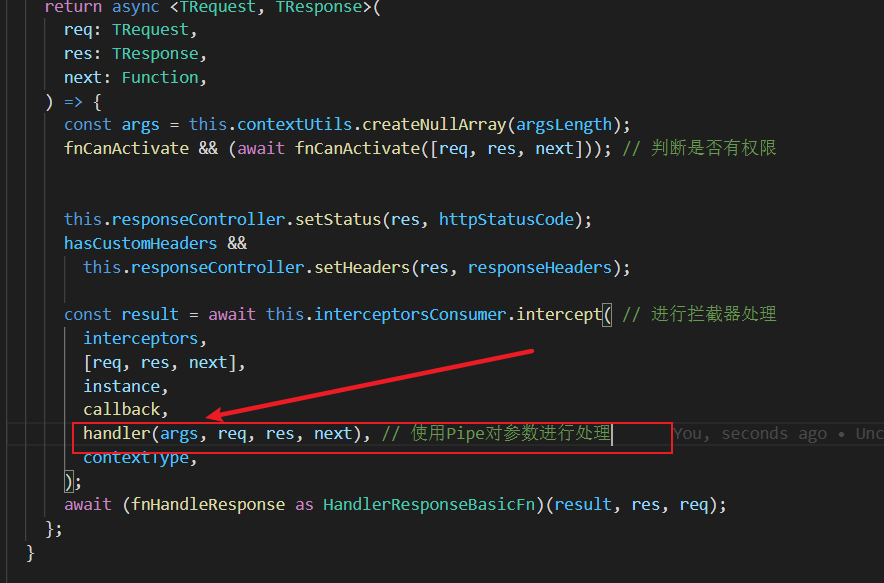

   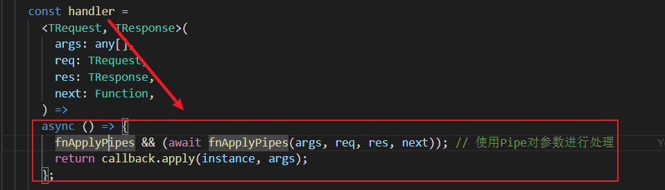

   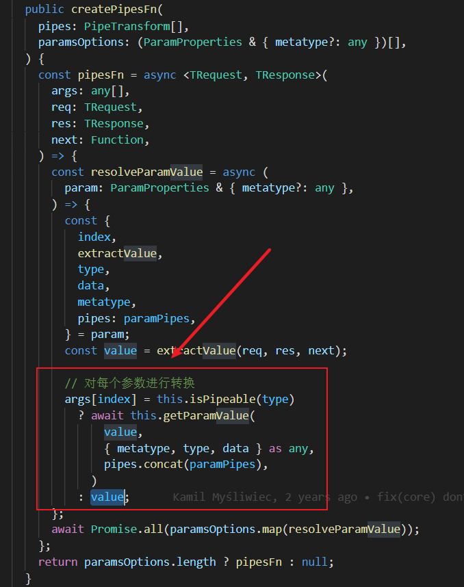

 ### (4) 总结

   ```
   MVC是Model View Controller的简写。请求先经过Controller，然后再调用Model进行Service、Repository完成业务逻辑，
   最后返回对应的View。
   ```

   ```
   IOC是Inverse Of Control的简写。IOC是指Nest.js会自动扫描带有@Controller、@Injectable装饰器的类，
   创建他们的对象，并根据依赖关系自动注入它依赖的对象，免去了手动创建和组装对象的麻烦。
   ```

   ```
   AOP是Aspect Oriented Program的简写。AOP是把通用的逻辑抽离出，通过切面编程的方式添加到某个方法，类上去，
   可以复用其通用逻辑。Gurad（守卫）、Pipe（管道）、Interceptor（拦截器）、ExceptionFilter（异常过滤器）、
   还有Middleware（中间件）。这些都是AOP思想的实现。其AOP在Nest.js的调用顺序可以由下面流程图表示：
   ```


   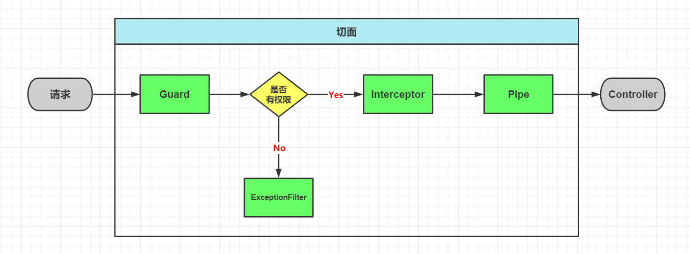

