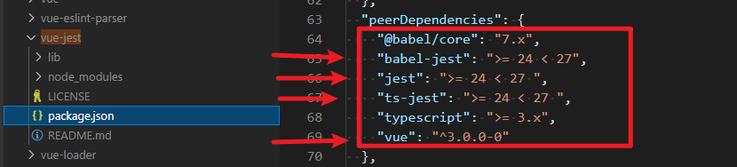

## 1. 依赖安装

相关依赖根据`vue-jest`的`package.json`文件，查看依赖包的版本限制如何。从`peerDependencies`属性可以看出，对应的依赖版本限制如下：




进行安装版本要求内的依赖包
```git
npm i babel-jest@26.0.0 jest@26.0.0 ts-jest@26.4.4 -D
```

接着还需要安装测试库以及其他的依赖包，这类依赖包可以安装最新的版本
```git
npm i @vue/babel-preset-app @testing-library/vue@next @testing-library/user-event @testing-library/jest-dom @types/jest vue-jest@next @vue/test-utils@next -D
```

关于测试库的使用的参考资料:

[Testing Library](https://testing-library.com/docs/ecosystem-jest-dom/)

[Vue Test Utils](https://test-utils.vuejs.org/guide/)

[Jest](https://jestjs.io/zh-Hans/docs/getting-started)


## 2. 配置文件

jest.config.js
```js
module.exports = {
	roots: [
		'<rootDir>/vue/tenui/src/'
	],
	testMatch: [
		'<rootDir>/vue/tenui/src/**/__tests__/**/*.{vue,js,jsx,ts,tsx}',
		'<rootDir>/vue/tenui/src/**/*.{spec,test}.{vue,js,jsx,ts,tsx}',
	],
	testEnvironment: 'jsdom',
	transform: {
		'^.+\\.(vue)$': '<rootDir>/node_modules/vue-jest',
		'^.+\\.(js|jsx|mjs|cjs|ts|tsx)$': '<rootDir>/node_modules/babel-jest',
	},
	transformIgnorePatterns: [
		'<rootDir>/node_modules/',
		'[/\\\\]node_modules[/\\\\].+\\.(js|jsx|mjs|cjs|ts|tsx)$',
		'^.+\\.module\\.(css|sass|scss|less)$',
	],
	moduleFileExtensions: [
		'vue',
		'js',
		'jsx',
		'ts',
		'tsx',
		'json',
		'node',
	],
	resetMocks: true,
  };
```

babel.config.js

```js
module.exports = {
	presets: [
		'@vue/app',
	],
};
```


## 3. 测试单文件SFC

TreeSelectCascader.vue

```vue
<template>
  <div class="cascader">
    <div class="popover-wrapper" v-if="popoverVisible" data-test="TreeSelectCascader">
      <TreeSelectCascaderItem :sourceItem="source" :height="height" :selected="selected" @update:selected="onUpdateSelected" />
    </div>
    result: {{ result }}
  </div>
</template>
```

TreeSelectCascader.spec.ts

```ts
import TreeSelectCascader from "../TreeSelectCascader.vue";
import { mount } from "@vue/test-utils";

test('TreeSelectCascader: ', async () => {
  // render component.
  const wrapper = mount(TreeSelectCascader);

  // mounted
  const textNode = await wrapper.get('[data-test="TreeSelectCascader"]');
  expect(textNode).toBeTruthy();

})
```


